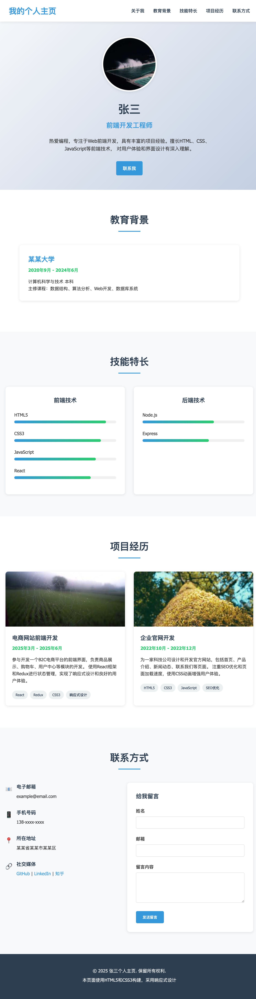

# CSS优化个人主页实验报告

## 基本信息
- **姓名**：[你的姓名]
- **学号**：[你的学号]
- **班级**：[你的班级]

## 实验目的

1. 掌握CSS的基本语法和引入方式
2. 能够使用CSS选择器精确选择HTML元素
3. 理解CSS盒模型并应用于页面布局
4. 掌握常用CSS属性，如文本样式、颜色、背景等
5. 能够使用浮动、定位和Flexbox进行页面布局
6. 了解响应式设计的基本概念和实现方法
7. 能够使用CSS过渡和动画增强用户体验

## 实验环境
- **操作系统**：[例如：Windows 10 / macOS]
- **开发工具**：[例如：VS Code / Sublime Text]
- **浏览器**：[例如：Chrome / Firefox / Safari]

## 实验内容与过程

### 1. HTML文档准备
准备HTML文档，包括：
- 使用了实践项目1中的HTML文档
- 对HTML文档做修改，以适应CSS样式
- 添加了新的HTML元素或结构

### 2. CSS文件创建与引入
创建和引入CSS文件：
- CSS文件的命名和位置
- 在HTML文档中引入CSS文件
- 可使用其他引入方式（如内联样式、内部样式表）

### 3. CSS样式实现

#### 3.1 全局样式和重置
- 重置浏览器默认样式
- 设置全局样式

#### 3.2 页面头部样式
- 页面头部的背景、颜色、字体等设计
- 导航菜单的布局和样式
- 使用固定定位或其他定位方式

#### 3.3 主要内容区域样式
- 各个部分的布局和设计
- 使用布局技术（Flexbox、Grid等）
- 处理图片、表格、列表等元素的样式

#### 3.4 联系方式和表单样式
- 联系方式部分的样式设计
- 表单元素的样式和交互效果
- 表单验证的交互反馈（如果有）

#### 3.5 页面底部样式
- 页面底部的设计和布局
- 添加额外的信息或功能

### 4. 响应式设计实现
实现响应式设计：
- 使用媒体查询
- 针对不同屏幕尺寸做调整
- 处理图片、表格等元素的响应式显示

## 实验结果与分析

### 1. 页面效果展示

请提供你的个人主页在不同设备上的截图（至少包括桌面端和移动端）：

#### 桌面端效果


#### 移动端效果


### 2. CSS技术分析

分析你在实验中使用的CSS技术，比如：
- 使用了哪些CSS选择器，它们的特点和优势是什么
- 如何应用CSS盒模型，遇到了哪些问题，如何解决
- 使用了哪些布局技术，为什么选择这些技术

### 3. 响应式设计分析

分析你的响应式设计实现，比如：
- 选择了哪些断点，为什么
- 针对不同设备做了哪些优化
- 响应式设计中有哪些挑战，如何解决

## 实验总结与体会

### 1. 实验收获

总结你在本次实验中的收获，比如：
- 对CSS的理解有哪些提升
- 掌握了哪些新的CSS技术和技巧
- 对前端开发有哪些新的认识

### 2. 遇到的问题与解决方案

描述你在实验过程中遇到的主要问题和解决方案，比如：
- 遇到了哪些技术难题
- 如何查找资料和解决问题
- 从这些问题中学到了什么

### 3. 实验反思

对本次实验的反思：
- 实验中有哪些可以改进的地方
- 对CSS学习有哪些新的思考
- 未来如何进一步提升CSS技能

## 扩展思考

1. CSS预处理器（如Sass、Less）相比原生CSS有哪些优势？
2. CSS框架（如Bootstrap、Tailwind CSS）在实际项目中的应用场景和优缺点是什么？
3. 如何在保证视觉效果的同时，优化CSS性能？
4. CSS在未来Web开发中的发展趋势是什么？
5. 如何平衡设计美观性和代码可维护性？

## 代码附录

请附上你的主要CSS代码（选择最核心、最能体现你技术水平的部分）：

```css
/* 在这里粘贴你的CSS代码 */
```