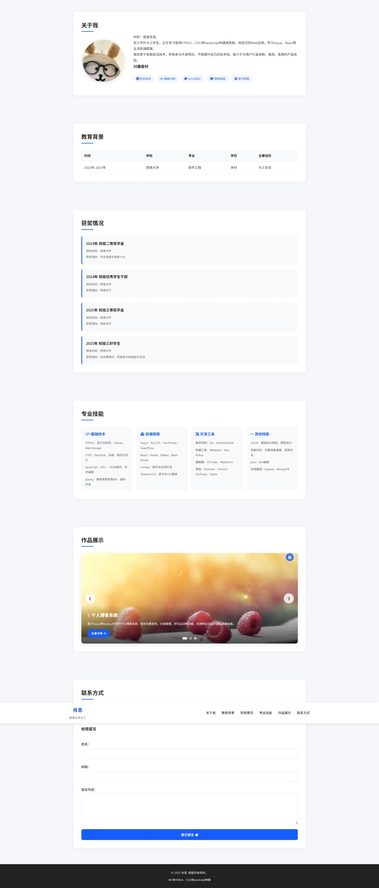
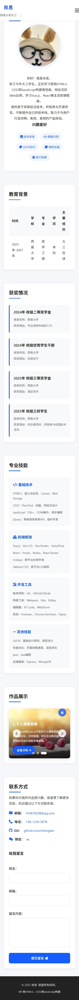

# CSS优化个人主页实验报告

## 基本信息
- **姓名**：[肖息]
- **学号**：[222023321062059]
- **班级**：[2023级软工中外02班]

## 实验目的

1. 掌握CSS的基本语法和引入方式
2. 能够使用CSS选择器精确选择HTML元素
3. 理解CSS盒模型并应用于页面布局
4. 掌握常用CSS属性，如文本样式、颜色、背景等
5. 能够使用浮动、定位和Flexbox进行页面布局
6. 了解响应式设计的基本概念和实现方法
7. 能够使用CSS过渡和动画增强用户体验

## 实验环境
- **操作系统**：[例如：Windows 10 / macOS]
- **开发工具**：[例如：VS Code / Sublime Text]
- **浏览器**：[例如：Chrome / Firefox / Safari]

## 实验内容与过程

### 1. HTML文档准备
准备HTML文档，包括：
- 使用了实践项目1中的HTML文档
- 对HTML文档做修改，以适应CSS样式
- 添加了新的HTML元素或结构

### 2. CSS文件创建与引入
创建和引入CSS文件：
- CSS文件的命名和位置
- 在HTML文档中引入CSS文件
- 可使用其他引入方式（如内联样式、内部样式表）

### 3. CSS样式实现

#### 3.1 全局样式和重置
- 重置浏览器默认样式
- 设置全局样式

#### 3.2 页面头部样式
- 页面头部的背景、颜色、字体等设计
- 导航菜单的布局和样式
- 使用固定定位或其他定位方式

#### 3.3 主要内容区域样式
- 各个部分的布局和设计
- 使用布局技术（Flexbox、Grid等）
- 处理图片、表格、列表等元素的样式

#### 3.4 联系方式和表单样式
- 联系方式部分的样式设计
- 表单元素的样式和交互效果
- 表单验证的交互反馈（如果有）

#### 3.5 页面底部样式
- 页面底部的设计和布局
- 添加额外的信息或功能

### 4. 响应式设计实现
实现响应式设计：
- 使用媒体查询
- 针对不同屏幕尺寸做调整
- 处理图片、表格等元素的响应式显示

## 实验结果与分析

### 1. 页面效果展示

请提供你的个人主页在不同设备上的截图（至少包括桌面端和移动端）：

#### 桌面端效果


#### 移动端效果


### 2. CSS技术分析

分析你在实验中使用的CSS技术，比如：
- 使用了哪些CSS选择器，它们的特点和优势是什么
  在本次实验中，使用了多种 CSS 选择器以实现精准的样式控制。包括通用选择器*用于全局样式重置，一次性移除所有元素的默认外边距和内边距，简化了基础样式的统一管理；元素选择器（如body、header、h2）用于定义特定 HTML 元素的默认样式；类选择器（如.container、.section-card）实现了样式的复用，使多个元素能共享相同样式规则；ID 选择器（如#about、#education）针对页面中唯一的区块进行样式定制；伪类选择器（如:hover、:focus）增强了交互效果，例如链接悬停时的颜色变化和下划线动画；伪元素选择器（如h2::after）用于创建装饰性元素，为标题添加了自定义下划线；还有组合选择器（如nav ul、.form-group label）用于定位特定层级的元素，提高样式的针对性。
- 如何应用CSS盒模型，遇到了哪些问题，如何解决
  CSS 盒模型的应用上，通过box-sizing: border-box全局设置，使元素的宽度和高度包含内边距和边框，避免了因内边距或边框增加导致元素实际尺寸超出预期的问题。在开发中曾遇到元素布局错位的情况，例如导航菜单因内边距计算方式不同而溢出容器，正是通过统一盒模型为border-box解决了这一问题，确保了布局的稳定性。
- 使用了哪些布局技术，为什么选择这些技术
  布局技术方面，主要采用了 Flexbox、Grid 布局和定位布局。Flexbox 广泛应用于一维布局场景，如header-content的两端对齐、导航菜单的水平排列、关于我部分的内容与图片对齐等，其优势在于能灵活处理元素的对齐、分布和重排，尤其适合响应式设计中的布局调整；Grid 布局用于二维布局，如技能列表（.skills-list）和获奖列表（.award-list），通过grid-template-columns实现了元素的自动换行和均匀分布，简化了多列布局的实现；定位布局（如position: fixed用于固定导航栏、position: absolute用于轮播图的幻灯片切换）则解决了特殊元素的位置控制需求，确保导航栏始终在视口顶部，轮播图的幻灯片能重叠显示。

### 3. 响应式设计分析

分析你的响应式设计实现，比如：
- 选择了哪些断点，为什么
  响应式设计中选择了三个主要断点：max-width: 1024px、max-width: 768px和max-width: 480px。这些断点对应了常见的设备尺寸范围，1024px 适配平板横屏及小屏桌面设备，768px 适配平板竖屏和大屏手机，480px 适配普通手机屏幕，能够覆盖大多数用户的设备场景。
- 针对不同设备做了哪些优化
  针对不同设备的优化措施包括：在 768px 及以下屏幕，隐藏传统导航菜单，显示汉堡菜单，点击后展开垂直排列的导航列表，节省横向空间；关于我部分从水平布局改为垂直布局，头像和文本居中显示，提升移动端阅读体验；轮播图高度随屏幕尺寸减小而降低（从 450px 依次调整为 400px、300px、250px），避免图片在小屏幕上显示过大；卡片内边距（.section-card）和间距（--card-margin）随屏幕缩小而减小，减少不必要的留白，提高内容密度；联系方式列表在 480px 以下改为垂直排列，避免横向拥挤。
- 响应式设计中有哪些挑战，如何解决
  响应式设计中遇到的主要挑战是导航菜单在移动端的交互体验和轮播图在不同屏幕尺寸下的显示效果。对于导航菜单，通过 JavaScript 监听汉堡菜单的点击事件，动态添加 / 移除show类来控制菜单的显示与隐藏，解决了移动端导航的空间占用问题；对于轮播图，通过调整图片的object-fit: cover属性确保图片在不同高度下保持比例裁剪，同时简化小屏幕上的文字内容样式（如缩小字体、减少内边距），保证轮播信息的可读性。

## 实验总结与体会

### 1. 实验收获

总结你在本次实验中的收获，比如：
- 对CSS的理解有哪些提升
  通过本次实验，对 CSS 的理解从基础语法层面提升到了工程化应用层面。例如，掌握了 CSS 变量（:root中定义的--primary、--shadow-md等）的使用，理解了其在样式统一管理和主题切换中的优势，能通过修改变量快速调整全局样式；深入实践了 Flexbox 和 Grid 布局，明确了两者的适用场景（一维 vs 二维），并能根据需求灵活选择；熟悉了过渡动画（transition）和变换（transform）的应用，实现了元素的平滑交互效果（如按钮悬停时的位移、链接下划线的展开动画）。
- 掌握了哪些新的CSS技术和技巧
  在技术技巧方面，学会了利用伪元素创建装饰性内容（如标题下划线），避免了冗余的 HTML 结构；掌握了响应式设计的核心思路，即 “一次设计，多端适配”，通过媒体查询和流式布局使页面在不同设备上都能保持良好体验；理解了 CSS 与 JavaScript 的协同工作方式，如通过 JS 控制元素的class来触发 CSS 定义的动画和样式变化（如滚动时导航栏的样式切换）。
- 对前端开发有哪些新的认识
  对前端开发的认识也更加全面，意识到前端开发不仅是实现视觉效果，更要关注用户体验，包括页面加载速度、交互流畅度、跨设备兼容性等。同时，体会到语义化 HTML 与 CSS 样式分离的重要性，良好的代码结构能提高可维护性和扩展性。

### 2. 遇到的问题与解决方案

描述你在实验过程中遇到的主要问题和解决方案，比如：
- 遇到了哪些技术难题
- 如何查找资料和解决问题
- 从这些问题中学到了什么
- 实验过程中遇到的主要问题包括：滚动时页面元素的渐入动画触发时机不准确，初始加载时部分元素未正确显示动画。通过调整checkVisibility函数中判断元素可见性的条件（rect.top < window.innerHeight - 100），使动画在元素顶部距离视口底部 100px 时触发，解决了触发时机过早或过晚的问题。
轮播图自动播放与手动控制的冲突也是一个难点，当用户点击左右按钮或指示器后，自动播放的计时器未重置，导致轮播节奏混乱。解决方案是在手动控制轮播（如点击prev、next按钮或dot指示器）时，先清除当前计时器，再重新启动计时，确保自动播放从当前幻灯片开始计算间隔。
表单验证中，初期对邮箱格式的正则表达式匹配不准确，导致部分有效邮箱被误判为无效。通过查阅 MDN 文档，优化了正则表达式，使其能正确匹配大多数标准邮箱格式，同时添加了更清晰的错误提示文本，提升了用户体验。
从这些问题中认识到，前端开发需要细致的调试和对边缘情况的考虑，同时善用官方文档和社区资源（如 Stack Overflow）能高效解决技术难题，而主动测试不同场景下的功能表现（如不同屏幕尺寸、不同交互方式）是保证产品质量的关键。

### 3. 实验反思

对本次实验的反思：
- 实验中有哪些可以改进的地方
  本次实验中存在一些可改进的地方：CSS 代码的复用性可以进一步提升，例如部分重复的样式（如卡片的border-radius、box-shadow）虽通过变量统一管理，但可考虑提取为公共类（如.card）进一步减少冗余；响应式设计的断点可以更细致，例如针对 768px 到 1024px 之间的屏幕尺寸，可增加更多中间断点以优化过渡效果；轮播图的动画效果较为简单，可尝试添加淡入淡出或滑动过渡，提升视觉体验。
- 对CSS学习有哪些新的思考
  对 CSS 学习的新思考是：CSS 不仅是 “样式表”，更是构建用户界面的核心工具，其背后涉及视觉设计、交互逻辑和性能优化等多个维度。例如，合理使用transform和opacity触发 GPU 加速，可减少页面重绘重排，提升动画性能；而语义化的样式命名（如.slide-info、.form-control）能提高代码的可读性和可维护性。
- 未来如何进一步提升CSS技能
  未来提升 CSS 技能的方向包括：学习 CSS 预处理器（如 Sass、Less）以增强样式的模块化和逻辑处理能力；深入研究 CSS Grid 的高级特性（如网格线命名、跨网格布局）以应对复杂布局需求；实践 CSS 架构模式（如 BEM）以规范大型项目的样式管理；同时关注 CSS 新特性（如容器查询、@layer），保持技术的更新迭代。

## 扩展思考

1. CSS预处理器（如Sass、Less）相比原生CSS有哪些优势？
   CSS预处理器（如Sass、Less）相比原生CSS提供了多项优势。首先，它支持变量，使得样式可重用和易于维护；其次，通过嵌套规则可以简化复杂的选择器结构，提高代码的可读性。混合宏和继承功能允许代码重用，避免重复编写相似样式。预处理器还支持数学运算，让尺寸和间距等样式计算更加灵活。此外，通过模块化，可以将样式分割成多个小文件，便于管理和维护。条件语句和循环进一步增强了样式的动态性，减少了冗余代码。总之，CSS预处理器提高了代码的可维护性、灵活性和开发效率，特别适用于大型项目和复杂的样式管理。
2. CSS框架（如Bootstrap、Tailwind CSS）在实际项目中的应用场景和优缺点是什么？
   CSS框架（如Bootstrap和Tailwind CSS）在实际项目中的应用主要体现在快速开发、响应式设计和团队协作上。Bootstrap提供了丰富的预定义组件和网格系统，适合快速搭建响应式网站和原型设计，尤其在团队开发中有助于确保界面的一致性。Tailwind CSS则以原子化的类为特点，允许开发者灵活组合样式，适用于需要高度定制化的项目，特别是在设计系统的实现上。两者的主要优点包括提高开发效率、简化响应式布局和提供一致的设计规范，然而它们也有一些缺点。Bootstrap可能导致页面样式过于通用，缺乏独特性，且文件体积较大；Tailwind虽然灵活，但可能使HTML代码冗长，且需要开发者掌握更多的类名。总的来说，Bootstrap适合快速开发和中小型项目，而Tailwind则更适合需要高度自定义的项目，但无论选择哪种框架，都需要权衡其带来的便利性与潜在的局限性。
3. 如何在保证视觉效果的同时，优化CSS性能？
   优化CSS性能的关键在于减少不必要的计算和资源消耗，同时保持良好的视觉效果。首先，应简化CSS选择器，避免过度嵌套和使用通配符选择器，从而减轻浏览器的计算负担。通过合并和压缩CSS文件，可以减少HTTP请求和文件体积，提高加载速度。此外，利用硬件加速（如 `transform` 和 `opacity`）来优化动画效果，以及精简复杂的动画和布局，能显著提升性能。对于响应式设计，应通过精准控制媒体查询和避免冗余代码来减少不必要的CSS加载。同时，使用CSS Grid和Flexbox布局代替传统浮动布局，不仅简化代码，还提高了渲染效率。进一步优化包括批量修改DOM样式、避免频繁重排和重绘、使用懒加载技术优化图片加载等，这些方法能够有效提升页面的渲染速度和响应性。总的来说，CSS性能优化需要综合考虑选择器复杂度、文件大小、动画效果、响应式设计等因素，以确保页面在保证视觉效果的同时，也能高效地加载和渲染。
4. CSS在未来Web开发中的发展趋势是什么？
   未来CSS的发展将集中在提高灵活性、响应性、可维护性和性能方面。CSS容器查询将使得样式能够根据容器大小而非视口大小调整，带来更精细的布局控制。CSS Grid布局的普及将简化复杂布局的实现，而CSS自定义属性（变量）将进一步提高样式的可维护性和灵活性，特别是在构建设计系统时。随着新特性的引入，如 `@layer` 和 `@scope`，CSS的组织和作用域管理将变得更加高效，帮助开发者避免样式冲突。跨设备适配能力的增强也使得Web开发能够更好地应对各种屏幕和设备。CSS与JavaScript的深度融合将带来更加动态和互动的用户体验，特别是在样式动态控制和动画方面。此外，随着智能CSS优化工具的出现，开发者可以更轻松地管理性能优化和冗余样式问题。CSS的模块化和组件化将进一步推动样式的封装和复用，提升代码的可维护性。总的来说，CSS将在未来成为更强大、更灵活、更高效的Web开发工具，推动开发者创造更加复杂和精美的用户界面。
5. 如何平衡设计美观性和代码可维护性？
   平衡设计美观性和代码可维护性需要采取一系列方法来确保两者的兼顾。首先，遵循设计系统和UI规范能够确保一致的视觉风格，并减少冗余和不一致的样式，从而提升代码的可维护性。组件化开发是关键，通过将界面拆分为可复用的组件，减少重复代码，同时保持灵活的样式管理。响应式设计利用现代布局技术（如CSS Grid和Flexbox）和媒体查询，确保在不同设备上都能保持优美的设计，而不增加过多复杂的代码。使用CSS预处理器和自定义变量，有助于更高效地管理样式，使得设计调整更加方便，同时避免重复代码和增加维护难度。为了避免过度装饰，设计应注重简洁性和可用性，避免复杂的动画和效果导致性能问题。通过渐进增强和优雅降级，可以确保页面在不同浏览器和设备上的表现都能保持良好，保证设计的可扩展性和兼容性。最后，清晰的命名约定和注释能够帮助团队成员理解和维护代码，而性能优化则确保在追求美观的同时不牺牲页面加载速度和用户体验。通过这些方法，开发者能够在保证设计美观性的同时，确保代码的简洁、可维护和高效。

## 代码附录

请附上你的主要CSS代码（选择最核心、最能体现你技术水平的部分）：

```css
/* 全局重置：统一浏览器默认样式，避免兼容性问题 */
* {
    margin: 0;
    padding: 0;
    box-sizing: border-box; /* 核心盒模型，避免宽高计算偏差 */
    font-family: 'Segoe UI', Tahoma, Geneva, Verdana, sans-serif;
}

/* CSS变量：集中管理样式原子，支持全局统一修改，降低维护成本 */
:root {
    --primary: #165DFF;
    --primary-dark: #0f48d1;
    --light-bg: #f5f7fa;
    --card-bg: #fff;
    --text-main: #333;
    --text-secondary: #666;
    --border-light: #eee;
    --shadow-sm: 0 3px 15px rgba(0, 0, 0, 0.05);
    --shadow-md: 0 4px 15px rgba(0, 0, 0, 0.1);
    --radius: 12px;
    --section-padding: 60px 0;
    --card-margin: 20px;
    --transition-default: all 0.3s ease; /* 统一过渡效果，保证动画一致性 */
}

/* 响应式网格布局：自动适配容器宽度，无需手动写媒体查询控制列数 */
.skills-list {
    margin-top: 20px;
    display: grid;
    grid-template-columns: repeat(auto-fit, minmax(250px, 1fr)); /* 核心自适应逻辑 */
    gap: 20px;
}

/* Flex布局：实现垂直居中、两端对齐、响应式换行 */
.header-content {
    display: flex;
    justify-content: space-between;
    align-items: center;
    padding: 15px 0;
}

.hobbies {
    list-style: none;
    display: flex;
    flex-wrap: wrap; /* 自动换行，适配小屏幕 */
    gap: 15px;
    justify-content: center;
}

/* 滚动入场动画：提升页面交互质感 */
section {
    padding: var(--section-padding);
    opacity: 0;
    transform: translateY(30px);
    transition: opacity 0.6s ease, transform 0.6s ease; /* 分离透明度和位移动画 */
}

section.visible {
    opacity: 1;
    transform: translateY(0);
}

/* 导航链接hover动画：细节交互优化 */
nav a {
    position: relative;
}

nav a::after {
    content: '';
    position: absolute;
    left: 0;
    bottom: 0;
    width: 0;
    height: 2px;
    background-color: var(--primary);
    transition: width 0.3s ease; /* 仅过渡宽度，性能更优 */
}

nav a:hover::after {
    width: 100%; /* 下划线平滑展开 */
}

/* 按钮交互：多状态反馈 */
.btn-submit {
    background-color: var(--primary);
    color: #fff;
    border: none;
    padding: 15px;
    border-radius: 8px;
    cursor: pointer;
    transition: var(--transition-default);
}

.btn-submit:hover {
    background-color: var(--primary-dark);
    transform: translateY(-2px); /* 微上浮效果，增强点击欲望 */
}

/* 表单焦点状态：提升可访问性 */
.form-control:focus {
    outline: none;
    border-color: var(--primary);
    box-shadow: 0 0 0 3px rgba(22, 93, 255, 0.1); /* 柔和焦点阴影，不刺眼 */
}

/* 断点分层：按设备尺寸精细化适配（768px/480px 覆盖主流设备） */
@media (max-width: 768px) {
    :root {
        --section-padding: 40px 0;
        --card-margin: 15px; /* 响应式下动态修改CSS变量，无需重复写样式 */
    }

    /* 汉堡菜单：移动端导航解决方案 */
    .hamburger {
        display: block;
    }

    nav ul {
        display: none;
        flex-direction: column;
        position: absolute;
        top: 70px;
        left: 0;
        width: 100%;
        background-color: var(--card-bg);
        box-shadow: 0 5px 10px rgba(0, 0, 0, 0.1);
        padding: 20px;
        gap: 15px;
    }

    nav ul.show {
        display: flex; /* 通过类控制显示隐藏，配合JS实现交互 */
    }

    /* 组件适配：横向布局转纵向布局 */
    #about .about-content {
        flex-direction: column;
        text-align: center;
    }

    .slider {
        height: 300px; /* 适配小屏幕的轮播高度 */
    }
}

@media (max-width: 480px) {
    :root {
        --section-padding: 30px 0;
        --card-margin: 10px;
    }

    .skills-list {
        grid-template-columns: 1fr; /* 超小屏幕下单列布局 */
    }

    .contact-list {
        flex-direction: column; /* 联系方式纵向排列 */
    }
}
```

我的主要js代码（选择最核心、最能体现你技术水平的部分）：

```js
// 图片轮播 - 完整功能实现（自动轮播+手动控制+状态切换+动态DOM）
const slider = document.querySelector('.slider');
const slides = document.querySelectorAll('.slide');
const prevBtn = document.querySelector('.prev');
const nextBtn = document.querySelector('.next');
const dots = document.querySelectorAll('.dot');
let currentIndex = 0;
let slideInterval;
let isPlaying = true;

// 核心：显示指定索引幻灯片（处理边界+状态同步）
function showSlide(index) {
    // 隐藏所有幻灯片+移除指示器激活状态（统一重置）
    slides.forEach(slide => slide.classList.remove('active'));
    dots.forEach(dot => dot.classList.remove('active'));
    
    // 边界处理：确保索引循环（避免越界）
    currentIndex = (index + slides.length) % slides.length;
    
    // 激活当前状态
    slides[currentIndex].classList.add('active');
    dots[currentIndex].classList.add('active');
}

// 上一张/下一张逻辑（复用showSlide，避免代码冗余）
function prevSlide() { showSlide(currentIndex - 1); }
function nextSlide() { showSlide(currentIndex + 1); }

// 事件绑定：按钮+指示器（多元素统一处理）
prevBtn.addEventListener('click', prevSlide);
nextBtn.addEventListener('click', nextSlide);
dots.forEach((dot, index) => dot.addEventListener('click', () => showSlide(index)));

// 自动轮播+鼠标悬停暂停（体验优化）
function startSlideInterval() {
    slideInterval = setInterval(nextSlide, 5000);
}
slider.addEventListener('mouseenter', () => clearInterval(slideInterval));
slider.addEventListener('mouseleave', () => isPlaying && startSlideInterval());

// 动态创建暂停/播放按钮（无需HTML冗余，体现DOM操作能力）
const playPauseBtn = document.createElement('button');
playPauseBtn.className = 'slider-btn play-pause';
playPauseBtn.innerHTML = '<i class="fas fa-pause"></i>';
playPauseBtn.style.top = '20px';
playPauseBtn.style.right = '20px';
document.querySelector('.slider-container').appendChild(playPauseBtn);

// 暂停/播放状态切换（状态管理核心）
playPauseBtn.addEventListener('click', () => {
    if (isPlaying) {
        clearInterval(slideInterval);
        playPauseBtn.innerHTML = '<i class="fas fa-play"></i>';
    } else {
        startSlideInterval();
        playPauseBtn.innerHTML = '<i class="fas fa-pause"></i>';
    }
    isPlaying = !isPlaying;
});

// 初始化（确保页面加载即正常运行）
showSlide(0);
startSlideInterval();

// 滚动渐入动画 - 精准判断元素可见性
function checkVisibility() {
    const sections = document.querySelectorAll('section');
    sections.forEach(section => {
        // 核心：用getBoundingClientRect()判断元素与视口的位置关系
        const rect = section.getBoundingClientRect();
        // 触发条件：版块顶部进入视口底部100px内（避免过早/过晚触发，提升体验）
        if (rect.top < window.innerHeight - 100) {
            section.classList.add('visible');
        }
    });
}

// 双触发时机：初始加载+滚动时（确保所有场景都能触发）
window.addEventListener('load', checkVisibility);
window.addEventListener('scroll', checkVisibility);

// 表单验证 - 多字段规则校验+即时反馈
const contactForm = document.getElementById('contactForm');
if (contactForm) { // 容错处理：避免元素不存在时报错
    contactForm.addEventListener('submit', function(e) {
        e.preventDefault(); // 阻止默认提交行为
        let isValid = true; // 验证状态标记
        
        // 1. 姓名验证（非空校验）
        const name = document.getElementById('name');
        const nameError = document.getElementById('nameError');
        if (!name.value.trim()) {
            nameError.textContent = '请输入姓名';
            nameError.style.display = 'block';
            isValid = false;
        } else {
            nameError.style.display = 'none';
        }
        
        // 2. 邮箱验证（正则表达式+格式校验）
        const email = document.getElementById('email');
        const emailError = document.getElementById('emailError');
        const emailRegex = /^[^\s@]+@[^\s@]+\.[^\s@]+$/;
        if (!emailRegex.test(email.value)) {
            emailError.textContent = '请输入有效的邮箱地址';
            emailError.style.display = 'block';
            isValid = false;
        } else {
            emailError.style.display = 'none';
        }
        
        // 3. 留言验证（长度校验）
        const message = document.getElementById('message');
        const messageError = document.getElementById('messageError');
        if (message.value.trim().length < 5) {
            messageError.textContent = '留言内容至少5个字符';
            messageError.style.display = 'block';
            isValid = false;
        } else {
            messageError.style.display = 'none';
        }
        
        // 验证通过：模拟提交+重置表单
        if (isValid) {
            alert('留言提交成功！');
            contactForm.reset();
        }
    });
}
```